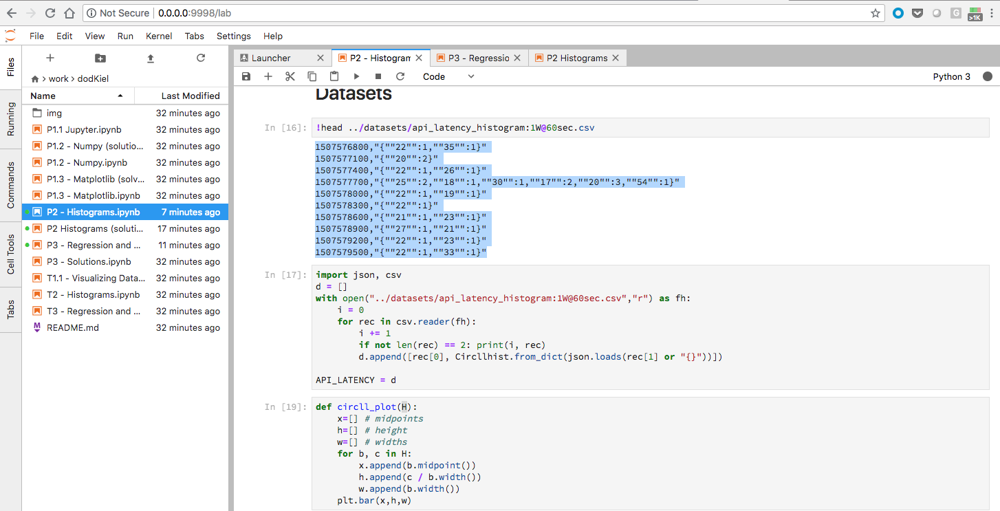
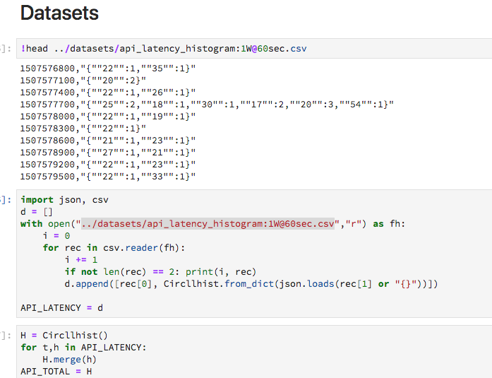
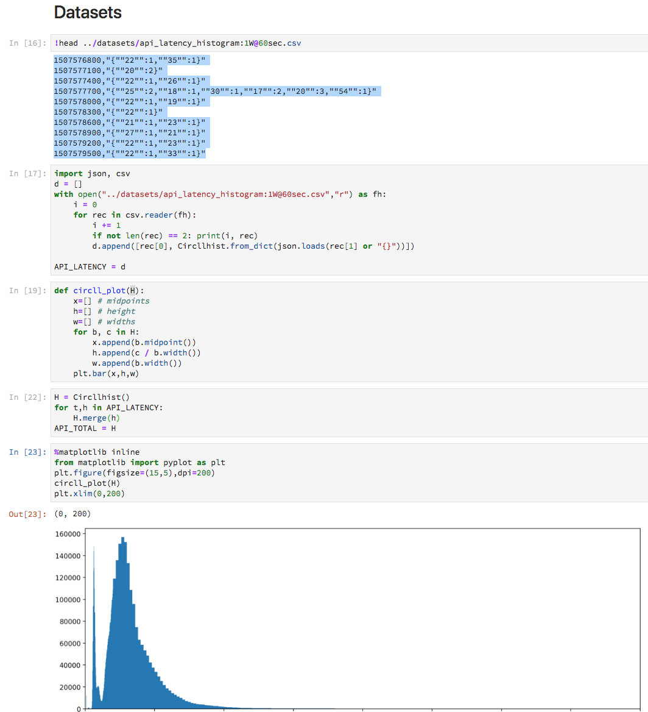
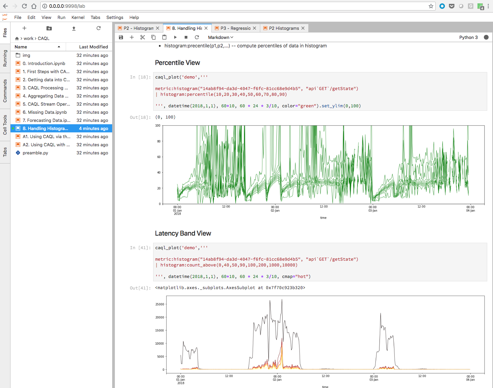

# [Main](../#tutorial-exercises) => Use the Jupyter notebook to analyze latency data

#### Let's use the Jupyter Notebook to run some analyses on latency data using histograms. We will look at an exercise from `Data Science for Effective Operations`.

* [Jupyter Notebook](http://jupyter.readthedocs.io/en/latest/)
* [Data Science for Effective Operations Jupyter Notebook](https://github.com:HeinrichHartmann/DS4OPS.git)


```
# git clone the repository, and use Docker to start it up

phred@harpua ~/dev $ git clone git@github.com:HeinrichHartmann/DS4OPS.git
Cloning into 'DS4OPS'...
remote: Counting objects: 349, done.
remote: Compressing objects: 100% (99/99), done.
remote: Total 349 (delta 53), reused 118 (delta 38), pack-reused 212
Receiving objects: 100% (349/349), 12.46 MiB | 20.78 MiB/s, done.
Resolving deltas: 100% (140/140), done.

phred@harpua ~/dev $ cd DS4OPS/

phred@harpua ~/dev/DS4OPS $ ./docker.sh --run
++ dirname ./docker.sh
+ cd .
+ [[ 1 > 0 ]]
+ cmd=--run
+ shift
+ case $cmd in
++ pwd
+ docker run --rm -it -p 9999:9999 -p 9998:9998 -v /Users/phred/dev/DS4OPS/work:/home/jovyan/work -v /Users/phred:/work heinrichhartmann/ds4ops
#
# Data Science 4 Effective Operations
#
# starting jupyter notebook&lab ...
done
#
# Notebook:
# * local url: http://0.0.0.0:9999/?token=bS5ng7D1WG74a9DijjUwmBnzmCzNnzhN
# * public url: http://76.14.121.188:9999/?token=bS5ng7D1WG74a9DijjUwmBnzmCzNnzhN
#
# Lab:
# * local url: http://0.0.0.0:9998/?token=bS5ng7D1WG74a9DijjUwmBnzmCzNnzhN
# * public url: http://76.14.121.188:9998/?token=bS5ng7D1WG74a9DijjUwmBnzmCzNnzhN
#
jovyan@33f6af7fc997:~$

```

Now pull up the local lab url in your browser






